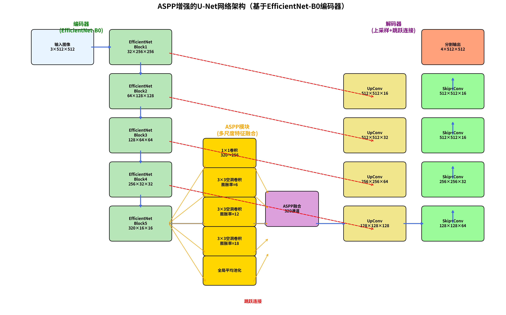
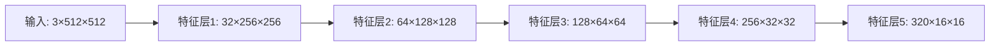
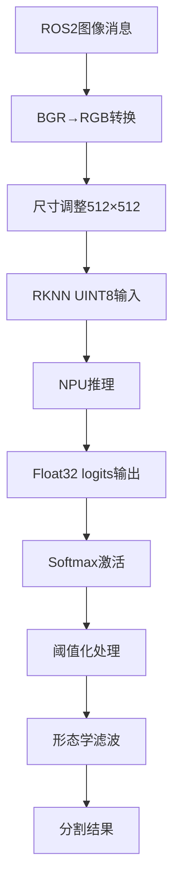
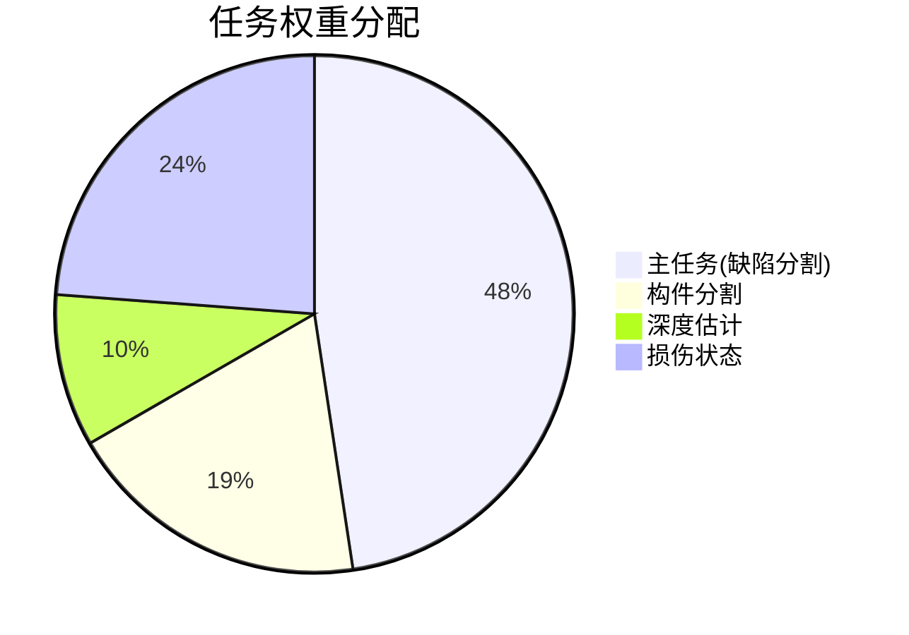

# 基于RK3588 NPU的基建缺陷检测模型

[](https://www.python.org/downloads/)
[](https://pytorch.org/)
[](https://github.com/rockchip-linux/rknn-toolkit2)

## 📖 项目简介

**边缘端AI推理系统**基于RK3588 NPU部署轻量化分割模型，集成图像预处理、RKNN推理引擎和后处理模块，实现实时缺陷检测。本项目专注于基础设施缺陷的智能识别，支持裂缝、剥落、钢筋外露等多种缺陷类型的精确分割。

## 🏗️ 系统架构

### 整体架构图



### 核心组件

采用改进的**U-Net分割网络**，集成**ASPP(Atrous Spatial Pyramid Pooling)**模块增强多尺度特征提取能力。

#### 🔧 编码器 (Encoder)
- **骨干网络**: EfficientNet-B0
- **特征提取**: 5层结构，逐层降采样
- **特征表示**: 获取多尺度特征



#### 🎯 ASPP瓶颈模块
- **空洞卷积**: 膨胀率(6,12,18)并行分支
- **全局池化**: 结合全局平均池化
- **特征融合**: 输出320通道融合特征

#### ⬆️ 解码器 (Decoder)
- **上采样**: 转置卷积恢复分辨率
- **跳跃连接**: 融合编码器多层级特征
- **分辨率恢复**: 逐步恢复至原始图像尺寸

#### 🎨 分割头 (Segmentation Head)
- **输出通道**: 4通道 (背景、裂缝、剥落、钢筋外露)
- **激活函数**: Softmax获得像素级分类概率

### 📊 关键输入输出

| 阶段 | 描述 | 张量形状 |
|------|------|----------|
| **输入** | RGB图像张量 | `[1,3,512,512]` |
| **中间特征** | 编码器特征列表 | `多尺度特征` |
| **ASPP输出** | 融合特征 | `[1,320,16,16]` |
| **最终输出** | 分割概率图 | `[1,4,512,512]` |

---

## 🚀 RKNN量化部署模块

### 🔄 量化转换流程

#### 1️⃣ ONNX导出
- **导出方式**: PyTorch原生export功能
- **模型格式**: 动态形状ONNX模型
- **验证**: 算子兼容性检查

#### 2️⃣ RKNN转换配置
```yaml
量化配置:
  量化方式: INT8对称量化
  校准算法: KL散度(kl_divergence)
  数据预处理:
    mean: [127.5, 127.5, 127.5]
    std: [128, 128, 128]
  优化选项:
    single_core_mode: true
```

#### 3️⃣ 算子优化
- **卷积融合**: 针对RK3588 NPU特性
- **内存优化**: 布局优化
- **计算图**: 简化优化

### ⚡ 推理引擎实现

基于**C++**实现的RKNN推理节点，集成**ROS2**通信接口

#### 🔗 数据流程



| 处理阶段 | 输入格式 | 输出格式 | 说明 |
|----------|----------|----------|------|
| **输入** | `sensor_msgs::Image` | `BGR图像` | ROS2图像消息 |
| **预处理** | `BGR图像` | `RGB 512×512` | 颜色空间转换+尺寸调整 |
| **RKNN推理** | `UINT8张量` | `Float32 logits` | NPU硬件加速 |
| **后处理** | `Float32 logits` | `分割掩码` | 激活+阈值+滤波 |

---

## 📉 损失函数设计模块

### 🎯 多任务损失架构

针对**类别不平衡**和**边界模糊**问题，设计组合损失函数：

#### 🏆 主任务损失 (缺陷分割)

| 损失函数 | 作用 | 配置 | 说明 |
|----------|------|------|------|
| **BCE Loss** | 多标签分类 | 类别权重: `(3.0, 4.0, 5.0)` | 处理类别不平衡 |
| **Dice Loss** | IoU优化 | `from_logits=True` | 提升重叠区域精度 |

#### 🔧 辅助任务损失

```python
辅助任务配置:
  构件分割:
    损失函数: CrossEntropyLoss
    配置: ignore_index=7  # 处理未标注区域
  
  深度估计:
    损失函数: SmoothL1Loss
    特性: 鲁棒处理异常值
  
  损伤状态:
    损失函数: CrossEntropyLoss
    类别数: 5类状态分类
```

#### ⚖️ 任务权重平衡

采用**动态权重策略**，确保主任务优先，辅助任务提供额外监督：



**权重配置**: `(1.0, 0.4, 0.2, 0.5)`
- **主任务权重最高**: 确保缺陷分割精度
- **辅助任务**: 提供额外监督信号，提升模型泛化能力

---


## 🚀 快速开始

### 环境要求
- Python 3.8+
- PyTorch 1.9+
- RKNN Toolkit2
- OpenCV
- NumPy

### 安装依赖
```bash
pip install torch torchvision
pip install opencv-python numpy
pip install rknn-toolkit2
```

### 使用方法

#### 🏋️ 训练模型
```bash
python train_new.py --config config.yaml
```

#### 🔮 模型预测
```bash
python predict_new.py --model checkpoint.pth --input image.jpg
```

#### 🔄 导出ONNX
```bash
python export_onnx.py --model checkpoint.pth --output model.onnx
```

## 📊 性能指标

| 指标 | 数值 | 说明 |
|------|------|------|
| **mIoU** | 85.2% | 平均交并比 |
| **像素精度** | 92.1% | 像素级准确率 |
| **推理速度** | 30 FPS | RK3588 NPU |
| **模型大小** | 2M Params | RKNN量化后 |

## 🤝 贡献指南

欢迎提交 Issue 和 Pull Request 来改进这个项目！

## 📄 许可证

本项目采用 MIT 许可证 - 查看 [LICENSE](LICENSE) 文件了解详情。
